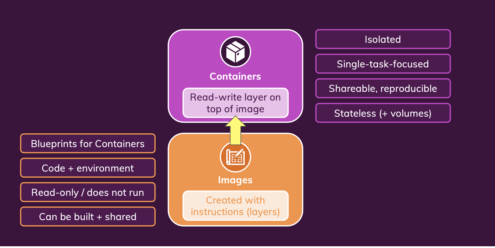
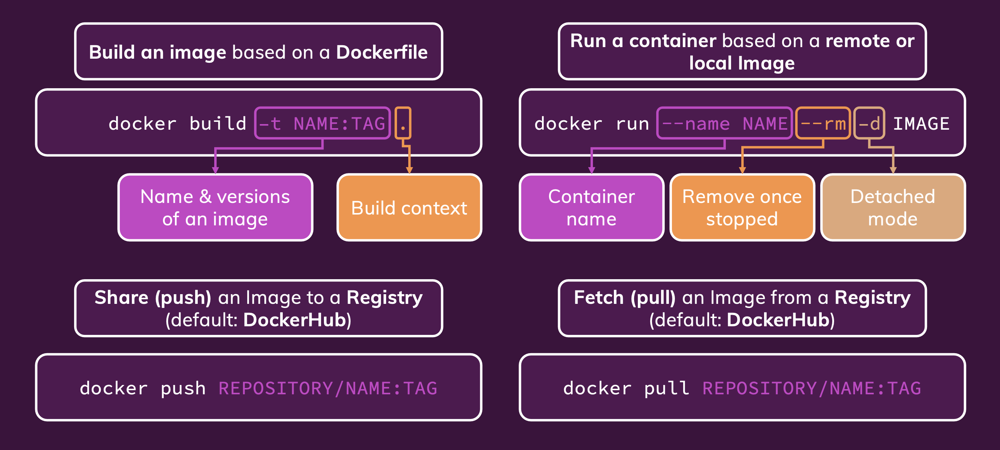
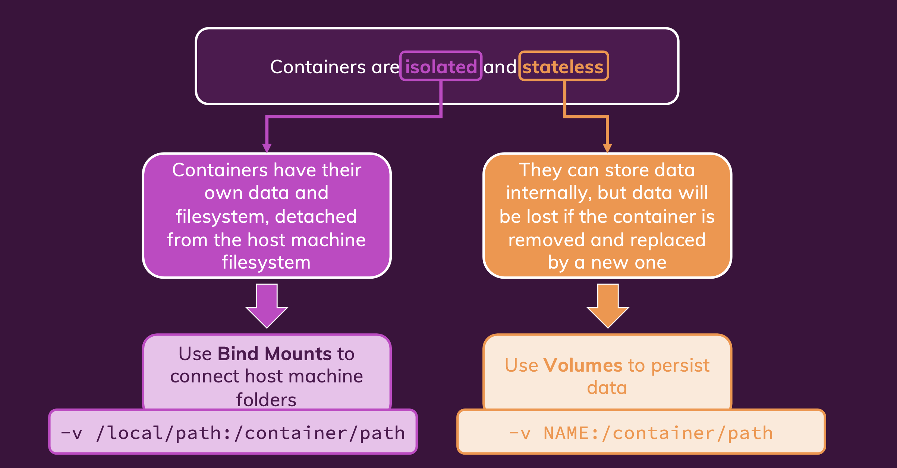
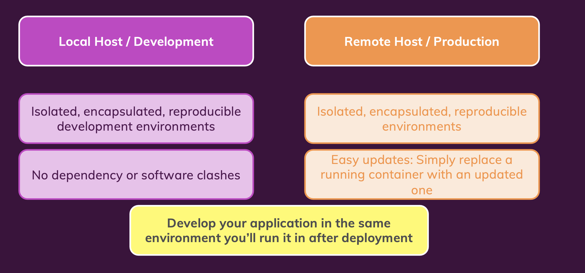

# Docker Summary

## Core Concepts

Containers and Images

## Key Command

## Data & Volumes

I container per definizione sono isolati e stateless.

> Bind Mounts (in sviluppo) - Volumi (produzione)

Bind Mounts, abbiamo un path sulla nostra host machine che vogliamo specchiare nel container, esempio per i file sorgente e vogliamo un live reload.

Volumes, non sappiamo dove risiederà, ma viene usato in modo tale da far sopravvivere i dati generati dal container anche al suo shut down.

> Bind Mounts = controllo path, Volumes = persistenza gestita.

## Containers & networs

Per definizione i container sono isolati ma possono essere connessi per mandare richieste.

- Possiamo usare il container IP e usarlo
- Possiamo creare un Docker Network e aggiungervi i container

## Docker compose

Invece di ripetere lunghi comandi, sopratutto se usiamo un environment multi container, ci permette di creare un file di configurazione che può essere lanciato semplicemente con
`docker compose up` o `docker compose down`

## Local VS Remote
Local sulla nostra macchina, o su un host remoto, quando facciamo il deploy.

