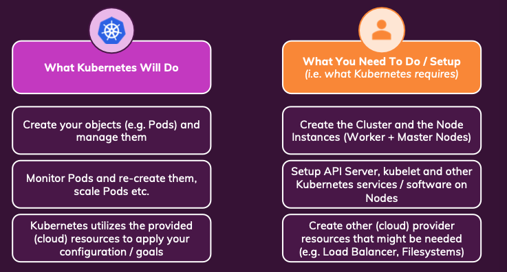
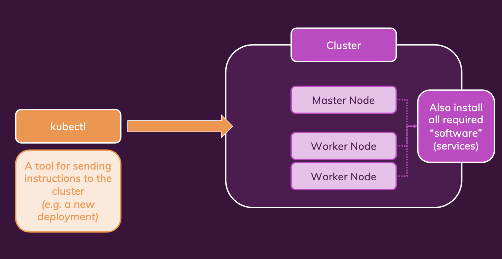
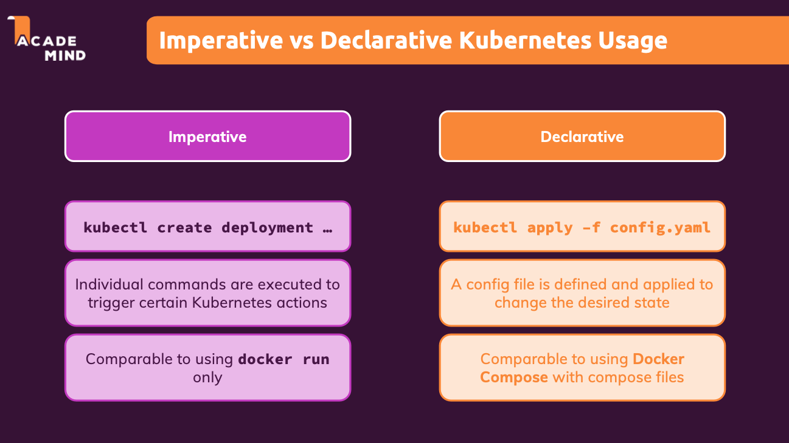

# K8S

è importante capire cosa farà per noi K8s e cosa no.
.
Non è un un cloud provider, ma è un framework.
Dobbiamo creare noi i Cluster e le istanze dei nodi, fare il setup di API server, e i software necessari e risorse (come load balancer, fylesystems etc.)

Ci aiuterà a creare i nostri oggetti (es pods) e li gestirà, farà il monitoring dei pods e li ricrea e scala.
K8s utilizzerà le risorse del provider cloud per applicare le nostre configurazioni.

[Kubermatic](https://www.kubermatic.com/) è un tool che può aiutare.
AWS ha anche il servizio EKS > Elastic K8s Service.

## Setup and installation steps

Ci servirà per prima cosa un **Cluster** che conterrà il nostro **Master Node** e uno o più **Worker Node** e tutti i software richiesti (services).

E il **Kubectl** che è un tool per mandare le istruzioni al cluster (ad es. un nuovo deployment)

.

Per impostare il cluster useremo un tool chiamato **[Minikube](https://minikube.sigs.k8s.io/docs/)** per simulare un'altra macchina, creerà un single node cluster.

> Io salto questo step perchè ho già abilitato tutto dentro DockerDesktop.

### Focus Kubectl

**kubectl** è lo strumento da riga di comando ufficiale per interagire con i cluster Kubernetes.

In termini semplici:
È il "telecomando" di Kubernetes - ti permette di controllare e gestire tutto quello che succede nel tuo cluster da terminale.

Cosa fa kubectl:

- **Crea risorse**: pod, servizi, deployment, ecc.
- **Visualizza lo stato**: cosa sta girando, se è sano, i log
- **Modifica configurazioni**: scaling, aggiornamenti, configurazioni
- **Elimina risorse**: pulizia e manutenzione
- **Debug**: ispeziona problemi, esegue comandi nei container

Esempi pratici:

```bash
kubectl get pods              # mostra i pod in esecuzione
kubectl create deployment     # crea un'applicazione
kubectl logs <pod-name>       # visualizza i log di un pod
kubectl scale deployment      # aumenta/diminuisce le repliche
kubectl delete pod <name>     # elimina un pod

```

**Analogia**:
Se Kubernetes è come un sistema operativo per container, kubectl è come la sua shell/terminale. Proprio come usi `ls`, `cd`, `mkdir` per il filesystem, usi `kubectl get`, `kubectl create`, `kubectl delete` per Kubernetes.

Caratteristiche:

- Funziona con qualsiasi cluster K8s (minikube, Docker Desktop, cloud)
- Usa file YAML per le configurazioni
- Ha centinaia di comandi e opzioni

Lista ampliata dei comandi `kubectl` fondamentali:

**🔍 Comandi di visualizzazione (GET):**

```bash
kubectl get pods                    # mostra i pod in esecuzione
kubectl get deployments            # mostra i deployment
kubectl get services               # mostra i servizi
kubectl get nodes                  # mostra i nodi del cluster
kubectl get all                    # mostra tutte le risorse principali
kubectl get all --all-namespaces  # mostra tutto in tutti i namespace
kubectl get pods -o wide          # output dettagliato
kubectl get pods --watch          # monitora i cambiamenti in tempo reale
```

**📝 Comandi di creazione (CREATE/APPLY):**

```bash
kubectl create deployment <name> --image=<image>  # crea un deployment
kubectl create service clusterip <name>           # crea un servizio
kubectl apply -f <file.yaml>                      # applica configurazione da file
kubectl create namespace <name>                   # crea un namespace
kubectl expose deployment <name> --port=80        # espone un deployment
```

**ℹ️ Comandi di descrizione (DESCRIBE):**

```bash
kubectl describe pod <pod-name>        # dettagli completi di un pod
kubectl describe deployment <name>     # dettagli di un deployment
kubectl describe service <name>        # dettagli di un servizio
kubectl describe node <node-name>      # dettagli di un nodo
```

**📋 Comandi di log e debug:**

```bash
kubectl logs <pod-name>                # visualizza i log di un pod
kubectl logs <pod-name> -f             # segue i log in tempo reale
kubectl logs <pod-name> --previous     # log del container precedente
kubectl exec -it <pod-name> -- /bin/bash  # entra nel pod (shell interattiva)
kubectl exec <pod-name> -- <command>   # esegue un comando nel pod
```

**⚙️ Comandi di modifica:**

```bash
kubectl scale deployment <name> --replicas=3  # scala a 3 repliche
kubectl edit deployment <name>                # modifica configurazione
kubectl patch deployment <name> -p '<json>'   # modifica parziale
kubectl set image deployment/<name> <container>=<new-image>  # aggiorna immagine
```

**🗑️ Comandi di eliminazione:**

```bash
kubectl delete pod <name>              # elimina un pod
kubectl delete deployment <name>       # elimina un deployment
kubectl delete service <name>          # elimina un servizio
kubectl delete -f <file.yaml>         # elimina risorse da file
kubectl delete all --all              # elimina tutto nel namespace corrente
```

**📁 Gestione namespace:**

```bash
kubectl get namespaces                 # mostra i namespace
kubectl config set-context --current --namespace=<name>  # cambia namespace di default
kubectl get pods -n <namespace>        # mostra pod in un namespace specifico
```

**🔧 Comandi di configurazione:**

```bash
kubectl config view                    # mostra la configurazione
kubectl config current-context        # mostra il contesto corrente
kubectl config get-contexts           # mostra tutti i contesti disponibili
kubectl config use-context <name>     # cambia contesto
```

**📊 Comandi di monitoraggio:**

```bash
kubectl top nodes                      # utilizzo CPU/memoria dei nodi
kubectl top pods                       # utilizzo CPU/memoria dei pod
kubectl get events                     # eventi recenti del cluster
kubectl get events --sort-by='.metadata.creationTimestamp'  # eventi ordinati
```

## Understanding K8s Objects (risorse)

K8S lavora con **Objects**, gli Objects sono le "entità" che Kubernetes gestisce - pensa a loro come ai "mattoni" con cui costruisci le tue applicazioni nel cluster.

I principali oggetti sono:

- **Pod**: Il più piccolo unit deployabile (uno o più container)
- **Deployment**: Gestisce un set di pod identici
- _Service_: Espone i pod alla rete (come un load balancer interno)
- _Volume_: Spazio di storage persistente per i dati

Questi oggetti possono essere creati in due modi:

- **Imperatively** (da comandi come `kubectl create deployment nginx --image=nginx`)
- **Declaratively** (Tramite file YAML/JSON)

### POD object

Il più piccolo unit deployabile (uno o più container)

- Contiene e runna uno o più container.

- Contengono risorse condivise (es. volumi) per tutti i pod containers.

- Ha un IP interno al cluster di default (che può essere usato per mandare richieste al container contenuto nel pod).
  - I containers contenuti in un pod possono comunicare tra loro tramite `localhost`

> I pod sono **effimeri**: Kubernetes li inizializza, ferma e sostituisce quando necessario.

Per poter essere gestiti da noi, abbiamo bisono di un **Controller** (es. Deployment)

### Deployment object

Solitamente non creiamo manualmente un pod, ma creiamo un oggetto Deployment.

- Può controllare uno o più pod.
  - Impostiamo uno stato desiderato, e K8S si occuperà di cambiare lo stato attuale.
    Definiamo cosa vogliamo e K8S si occuperà di farlo (es numero di istanze e quali container runnare)
  - Il Deploy può essere messo in pausa, cancellato o far un rollback
  - Il Deploy può essere scalato dinamicamente e automaticamente (esempio impostando una certa metrica, che se viene superata fa innescare l'aumento dei pod e viceversa.)

### Comandi base

## Schema Comandi kubectl - Guida Rapida

## 🔍 **VISUALIZZARE** (GET)

```bash
kubectl get pods                    # mostra pod
kubectl get deployments           # mostra deployment
kubectl get services              # mostra servizi
kubectl get nodes                 # mostra nodi
kubectl get all                   # mostra tutto nel namespace corrente
kubectl get all --all-namespaces # mostra tutto ovunque
kubectl get pods -o wide         # output dettagliato
kubectl get pods --watch         # monitora in tempo reale
```

## 📝 **CREARE** (CREATE/APPLY)

```bash
kubectl create deployment <name> --image=<image>    # crea deployment
kubectl create namespace <name>                     # crea namespace
kubectl apply -f <file.yaml>                       # applica da file YAML
kubectl expose deployment <name> --port=80         # espone servizio
kubectl create service clusterip <name>            # crea servizio
```

## ℹ️ **DETTAGLI** (DESCRIBE)

```bash
kubectl describe pod <name>        # dettagli completi pod
kubectl describe deployment <name> # dettagli deployment
kubectl describe service <name>    # dettagli servizio
kubectl describe node <name>       # dettagli nodo
```

## 📋 **LOG & DEBUG**

```bash
kubectl logs <pod-name>                    # visualizza log
kubectl logs <pod-name> -f                 # segui log in tempo reale
kubectl exec -it <pod-name> -- /bin/bash   # entra nel pod (shell)
kubectl exec <pod-name> -- <command>       # esegui comando nel pod
```

## ⚙️ **MODIFICARE**

```bash
kubectl scale deployment <name> --replicas=3      # scala repliche
kubectl edit deployment <name>                    # modifica configurazione
kubectl set image deployment/<name> container=<new-image>  # aggiorna immagine
kubectl patch deployment <name> -p '<json>'       # modifica parziale
```

## 🗑️ **ELIMINARE** (DELETE)

```bash
kubectl delete pod <name>           # elimina pod
kubectl delete deployment <name>    # elimina deployment
kubectl delete service <name>       # elimina servizio
kubectl delete -f <file.yaml>      # elimina da file
kubectl delete all --all           # elimina tutto nel namespace
```

## 📁 **NAMESPACE**

```bash
kubectl get namespaces                     # mostra namespace
kubectl create namespace <name>            # crea namespace
kubectl config set-context --current --namespace=<name>  # cambia namespace
kubectl get pods -n <namespace>            # opera in namespace specifico
```

## 🔧 **CONFIGURAZIONE CLUSTER**

```bash
kubectl config view                        # mostra configurazione
kubectl config current-context            # contesto attuale
kubectl config get-contexts               # tutti i contesti
kubectl config use-context <name>         # cambia contesto/cluster
kubectl cluster-info                       # info cluster
```

## 📊 **MONITORAGGIO**

```bash
kubectl top nodes                          # uso CPU/memoria nodi
kubectl top pods                           # uso CPU/memoria pod
kubectl get events                         # eventi recenti
kubectl get events --sort-by='.metadata.creationTimestamp'  # eventi ordinati
```

---

## 🚀 **WORKFLOW TIPICO**

### Per iniziare un nuovo progetto:

```bash
1. kubectl create namespace mio-progetto
2. kubectl config set-context --current --namespace=mio-progetto
3. kubectl create deployment app --image=nginx
4. kubectl get all
```

### Per debug:

```bash
1. kubectl get pods
2. kubectl describe pod <name>
3. kubectl logs <name>
4. kubectl exec -it <name> -- /bin/bash
```

### Per cleanup:

```bash
kubectl delete all --all -n <namespace>
kubectl delete namespace <namespace>
```

---

**💡 Pro Tips:**

- Usa `--dry-run=client -o yaml` per vedere il YAML senza applicarlo
- Usa `-o wide` per output dettagliato
- Usa `--watch` per monitorare cambiamenti
- Usa `-n <namespace>` per operare su namespace specifici

## First demo imperative approach

```bash
kubectl create namespace corso-kubernetes`
# Lavori in namespace specifici:
kubectl config set-context --current --namespace=corso-kubernetes
kubectl get pods  # vedi solo i pod di questo progetto
```

`docker build -t pandagandocker/kub-first-app .`

`docker push pandagandocker/kub-first-app`

```bash
kubectl create deployment first-app --image=pandagandocker/kub-first-app
```

---

❯ kubectl get deployments
NAME READY UP-TO-DATE AVAILABLE AGE
first-app 1/1 1 1 14s

❯ kubectl get pods
NAME READY STATUS RESTARTS AGE
first-app-7bb547bb98-fm95q 1/1 Running 0 53s

---

Cosa è successo con questo comando?

`kubectl create deployment first-app --image=pandagandocker/kub-first-app`

[](behind_scene.png)

Quando lo eseguiamo il **Master Node (Control Plane)** riceve la richiesta:

- **kubectl** invia il comando al **kube-apiserver**
- L'API server valida e salva la configurazione in **etcd** (il database)

**Scheduler entra in azione:**

- Analizza i **Worker Node** disponibili
- Guarda le risorse (CPU, RAM, storage)
- **Decide il nodo migliore** per il tuo Pod
- Nel mio caso Docker Desktop: solo 1 nodo, quindi scelta facile!

**Worker Node riceve l'ordine:**

- Il **kubelet** (agente sul worker) riceve istruzioni
- **Tira l'immagine** `pandagandocker/kub-first-app` da Docker Hub
- **Crea il Container** dentro un **Pod**

**Deployment Controller si attiva:**

- Monitora che il Pod sia "healthy"
- Se il Pod muore, ne crea uno nuovo
- Gestisce scaling, rolling updates, etc.

**Nel mio ambiente Docker Desktop:**

```bash
# Il tuo nodo unico:
kubectl get nodes
# docker-desktop (Master + Worker insieme)

# Il deployment creato:
kubectl get deployments
# first-app

# Il pod risultante:
kubectl get pods
# first-app-xxxxxxxxx-xxxxx
```

**In sintesi:** do un comando, Kubernetes orchestra tutto automaticamente per mantenere l'app sempre running! 🎯

## Service Object

Per raggiungere un Pod e un container all'interno di un pod abbiamo bisogno di un **Service**.

Un servizio è responsabile per:

Esporre i pods al cluster o esternamente:

- Ogni pods ha un suo ip interno al cluster possiamo vederlo con
  `kubectl describe pod <nome-pod>` \
  `kubectl describe pod first-app-7bb547bb98-fm95q` \
   Name: first-app-7bb547bb98-fm95q \
   Namespace: corso-kubernetes \
   Priority: 0\
   Service Account: default\
   Node: docker-desktop/192.168.65.3\
   Start Time: Thu, 25 Sep 2025 \
   pod-template-hash=7bb547bb98\
   Annotations: <none>\
   Status: Running\
   IP: 10.1.0.62

  ***

      **Problema** come su AWS ogni volta **questo IP cambia** quando il pod viene sostituito (ad esempio se abbiamo lo scaling attivo)

- Service Group Pods con un IP condiviso
- I Servizi permetto accesso esterno ai PODS

> Senza **Servizi** i pods sono difficilmente raggiungibili, e anche comunicare con essi è difficile. E raggiungere un pod dall'esterno del Cluster non è possibile senza usare un servizio

## Exposing a Deployment with a Service

`kubectl expose deployment first-app --type=LoadBalancer --port=8080`
Tipi di porta che possiamo dare al parametro type
`--type=ClusterIP`
`--type=NodePort`
`--type=LoadBalancer`

Il run del comando precedente ci da `service/first-app exposed`
Per vedere l'ip che viene esposto grazie al Load Balancer
`kubectl get services`
NAME TYPE CLUSTER-IP EXTERNAL-IP PORT(S) AGE
first-app LoadBalancer 10.103.28.141 localhost 8080:31480/TCP 37s

### Cosa è un LoadBalancer

Cos'è un LoadBalancer:
Un LoadBalancer è un componente che:

- Fornisce un punto di accesso stabile (IP fisso)
- Distribuisce il traffico tra più istanze
- Monitora la salute delle istanze

Il problema che risolve:
Senza LoadBalancer:

```bash
bashPod-1: IP 10.1.0.5 (può morire/cambiare)
Pod-2: IP 10.1.0.8 (può morire/cambiare)
Pod-3: IP 10.1.0.12 (può morire/cambiare)

# Gli utenti come si collegano? 🤔
```

Con LoadBalancer:

```bash
bashLoadBalancer: IP FISSO 203.123.45.67
    ↓ (distribuisce traffico a)
Pod-1: IP 10.1.0.5
Pod-2: IP 10.1.0.8
Pod-3: IP 10.1.0.12

# Gli utenti si collegano sempre a 203.123.45.67! ✅
```

**In AWS vs Kubernetes:**
AWS Application/Network LoadBalancer:

- IP esterno fisso per i tuoi servizi
- Distribuisce traffico tra le istanze EC2
- Auto-scaling: aggiunge/rimuove istanze
- Health checks: controlla che le app siano healthy

Kubernetes LoadBalancer Service:

- Stesso concetto ma per i Pod
- IP stabile che non cambia al restart dei Pod
- Load balancing automatico tra le repliche
- Service discovery interno al cluster

Nel mio esempio pratico:
`bashkubectl expose deployment first-app --type=LoadBalancer --port=8080`
Cosa creo:

```bash
bashfirst-app Service (LoadBalancer)
├── IP stabile: localhost:8080
└── Punta ai Pod: first-app-xxx-xxx

# Se il Pod muore e viene ricreato:
first-app-xxx-xxx (NUOVO POD, nuovo IP interno)
# Ma tu accedi sempre tramite: localhost:8080 ✅
```

I tipi di Service in Kubernetes:

- **ClusterIP**: Solo interno al cluster
- **NodePort**: Esposto su porta specifica del nodo
- **LoadBalancer**: Esposto esternamente con IP stabile
- **ExternalName**: Alias per servizi esterni

Analogia pratica:

> LoadBalancer = Receptionist di un hotel

- Gli ospiti chiamano sempre lo stesso numero (IP fisso)
- Il receptionist smista le chiamate alle stanze disponibili
- Se una stanza è occupata, reindirizza ad un'altra
- Gli ospiti non devono sapere quale stanza specifica

## Restarting Containers

Se visitiamo `/error` la nostra app andrà in crash, e questo porterà K8S a fare in atuomatico a un restart del pods.

```
❯ kubectl get pods
NAME                         READY   STATUS    RESTARTS      AGE
first-app-7bb547bb98-fm95q   1/1     Running   3 (35s ago)   19h
❯ kubectl get pods
NAME                         READY   STATUS   RESTARTS      AGE
first-app-7bb547bb98-fm95q   0/1     Error    3 (51s ago)   19h
❯ kubectl get pods
NAME                         READY   STATUS   RESTARTS      AGE
first-app-7bb547bb98-fm95q   0/1     Error    3 (55s ago)   19h
❯ kubectl get pods
NAME                         READY   STATUS   RESTARTS      AGE
first-app-7bb547bb98-fm95q   0/1     Error    3 (60s ago)   19h
❯ kubectl get pods
NAME                         READY   STATUS    RESTARTS      AGE
first-app-7bb547bb98-fm95q   1/1     Running   4 (26s ago)   19h

```

## Scaling in Action

`kubectl get deployments`

```
❯ kubectl get deployments
NAME        READY   UP-TO-DATE   AVAILABLE   AGE
first-app   1/1     1            1           19h
```

Per attivare lo scaling dopo aver visto il nome del nostro deploy

`kubectl scale deployment/first-app --replicas=3`

> Un **replica** è una istanza di un pod, significa che quel pod/container specifico viene fatto girare il numero di volte che specifichiamo

Visto che abbiamo un **load balancer** attivo, il traffico verrà distribuito tra i vari pods, e ad esempio se uno crash su /error, il traffico verrà spostato su quello funzionante.

## Updating Deployment

Se ad esempio cambiamo qualcosa nel nostro codice sorgente.

Dobbiamo ri-fare il build dell'img (questo ovviamente non cambia)
`docker build -t pandagandocker/kub-first-app:2 .`

rifacciamo il push della nuova img con tag
`docker push pandagandocker/kub-first-app:2`

e diciamo a k8s di usare la nuova img
`kubectl set image deployment/first-app kub-first-app=pandagandocker/kub-first-app:2`

> Le img vengono aggiornate da k8s solo se hanno un nuovo tag.

Per controllare lo stato:
`kubectl rollout status deployment/first-app`

> deployment "first-app" successfully rolled out

[](update_image.png)

## Deployment rollback history

> Per annullare l'ultimo deployment
> `kubectl rollout undo deployment/first-app`

Per controllare la storia
`kubectl rollout history deployment/first-app`

deployment.apps/first-app \
REVISION CHANGE-CAUSE \
1 `<none>` \
2 `<none>` \

Se vogliamo ispezionare una revisione in particolare

`kubectl rollout history deployment/first-app --revision=2`

deployment.apps/first-app with revision #2\
Pod Template:\
 Labels: app=first-app\
 pod-template-hash=5478c5b658\
 Containers:\
 kub-first-app:\
 Image: pandagandocker/kub-first-app:2\
 Port: `<none>`\
 Host Port: `<none>`\
 Environment: `<none>`\
 Mounts: `<none>`\
 Volumes: `<none>`\
 Node-Selectors: `<none>`\
 Tolerations: `<none>`

> per fare il rollaback a una revisione specifica:
> `kubectl rollout undo deployment/first-app --to-revision=1`

> Ora vogliamo passare dall'approccio **imperativo** a quello **dichiarativo**.

Per prima cosa eliminiamo il nostro servizio
`kubectl delete service first-app` e il deployment
`kubectl delete deployment first-app`

## The imperative vs declarite approach

Possiamo crea un file di configurazione, **Resource Definition** in un file YAML.



## Creating a Deployment Configuration file (declarite approach)

Creiamo un file `deployment.yaml` per specificare l'api version, controlliamo la documentazione [qui](https://kubernetes.io/docs/concepts/workloads/controllers/deployment/)

Per applicare il file di configurazione
`kubectl apply -f=deployment.yaml`

```bash
apiVersion: apps/v1
kind: Deployment
metadata:
  name: second-app-deployment
spec:
  replicas: 1
  # selezioniamo il pod tramite l'etichetta
  selector:
    matchLabels:
      app: second-app
      tier: backend
  # definiamo il pod, non specifichiamo kind: Pod perchè è implicito
  template:
    metadata:
      labels:
        app: second-app
        tier: backend
    spec:
      containers:
        # definiamo una lista di container, ogni container è indicato da un trattino
        - name: second-node
          image: pandagandocker/kub-first-app:2
```

Oltre a questo file dobbiamo creare il service file `service.yaml`, controlliamo la documentazione [qui](https://kubernetes.io/docs/concepts/services-networking/service/). Ci serve un servizio per esporre il cluster al mondo esterno.

```bash
apiVersion: v1
kind: Service
metadata:
  name: backend
spec:
  type: LoadBalancer
  selector:
    app: second-app
  ports:
    - protocol: TCP
      # il servizio espone la 80 e la mappa alla 8080 del container
      port: 80
      targetPort: 8080
```

`kubectl apply -f=service.yaml`

In questo modo possiamo visualizzare la nostra app da browser.

## Updating & Deleting Resources

Se ad esempio vogliamo moficare il numero di replicas, cambiamo il valore nel file di configurazione e lo riapplichiamo con `kubectl apply -f=deployment.yaml`

Per cancellare `kubectl delete -f=deployment.yaml` in questo modo cancella le risorse che sono specificate dal file.

## Multiple vs Single Config Files

Nel nostro caso ad esempio i due file di configurazione potrebbero essere fusi in uno.
Ma ogni file deve essere separata per indicare un nuovo oggetto da `---`.

Quando combiniamo i file in un unico è buona pratica **mettere prima il service**, perchè le risorse vengono create **From top to bottom**.
`kubectl delete -f=deployment.yaml -f=service.yaml`
`kubectl apply -f=master-deployment.yaml`

## More on Labels and Selectors

### Labels (Etichette)

Definizione:
Labels sono coppie chiave-valore che attacchi agli oggetti Kubernetes per identificarli e organizzarli.

Caratteristiche:

- Puoi mettere quanti labels vuoi
- Sono flessibili (crei le chiavi che vuoi)
- Non devono essere unici (più pod possono avere lo stesso label)
- Usati per organizzare e filtrare risorse

### Selectors

Definizione:
Selectors sono query/filtri che cercano oggetti in base ai loro labels. Dicono a Kubernetes "trova tutti gli oggetti che hanno questi labels".

**Tipi di selectors**

Equality-based (uguaglianza)

```yaml
selector:
  app: frontend # app DEVE essere "frontend"
  environment: production # environment DEVE essere "production"
```

Set-based (insieme)

```yaml
selector:
  matchLabels:
    app: frontend
  matchExpressions:
    - key: environment
      operator: In
      values: [production, staging] # environment può essere production O staging
    - key: version
      operator: NotIn
      values: ["1.0"] # version NON deve essere 1.0
```

### matchLabels vs matchExpression

Le matchExpressions sono un modo più potente e flessibile di selezionare oggetti rispetto ai semplici matchLabels.

```yaml
selector:
  matchExpressions:
    - key: app
      operator: In
      values: [frontend, backend]
# Significato: app può essere "frontend" OR "backend"
```

**Operatori disponibili**
`In` Deve essere uno dei valori

```yaml
matchExpressions:
  - key: environment
    operator: In
    values: [production, staging]
# env = production OR env = staging
```

`NotIn` Non deve essere nessuno dei valori

```yaml
matchExpressions:
  - key: environment
    operator: NotIn
    values: [development, test]
# env ≠ development AND env ≠ test
```

`Exists` Il lbale deve esister

```yaml
matchExpressions:
  - key: version
    operator: Exists
# Qualsiasi pod che ha il label "version", non importa il valore
```

`DoesNotExist` non deve esistere

```yaml
matchExpressions:
  - key: deprecated
    operator: DoesNotExist
# Solo pod che NON hanno il label "deprecated"
```

| Operatore      | Descrizione                        | Esempio                |
| -------------- | ---------------------------------- | ---------------------- |
| `In`           | Valore deve essere nella lista     | `env: [prod, staging]` |
| `NotIn`        | Valore NON deve essere nella lista | `version: [1.0, 1.1]`  |
| `Exist`        | Label deve esistere                | `tier` presente        |
| `DoesNotExist` | Label NON deve esistere            | `deprecated` assente   |

## Liveness Probes

nelle specifiche del container possiamo aggiungere un parametro `livenessProbe`.
**livenessProbe** è un meccanismo di Kubernetes per verificare se un container è ancora vivo e funzionante.

È un "controllo di salute" che Kubernetes esegue periodicamente per verificare se l'applicazione dentro il container è ancora responsive. Se fallisce, Kubernetes riavvia il container.

```yaml
containers:
  # definiamo una lista di container, ogni container è indicato da un trattino
  - name: second-node
    image: pandagandocker/kub-first-app:2
    # Check liveness probe
    livenessProbe:
      httpGet:
        path: /
        port: 8080
      periodSeconds: 10
      initialDelaySeconds: 5
```

## A closer look at the configuration Options

Dalla documentazione possiamo vedere che ad esempio per i containers possiamo specificare anche un parametro `imagePullPolicy` [documentazione](https://kubernetes.io/docs/concepts/containers/images/)
per specificare quando deve essere fatto il pull dell'immagine specificata.
