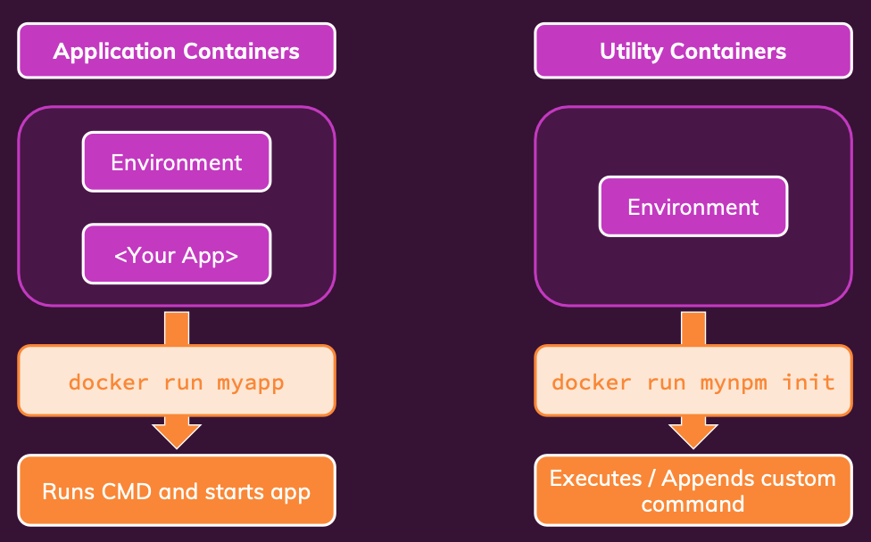

# Utility Containers

Non è un termine ufficiale.



A volte potremmo dover creare dei container che non runnano un'app, ma solo un **environment**

`docker run -it -d node`

Per usare `exec` ci serve il nome del container. -> `docker ps`
`docker exec -it compassionate_moore npm init`
Oppure possiamo:
`docker run -it node npm init`

## Build utility Docker container

Creo un docker file super base

```
FROM node:14-alpine

WORKDIR /app

```

Buildiamo e runniamo img
`docker build -t node-util .`
`docker run -it -v /Users/pandagan/workspace/projects/02_docker_udemy/section_7_utility_containers/docker-complete:/app node-util npm init`

In questo modo possiamo avere un ambiente senza dover installare node sulla nostra macchina.

Dovremmo restringere però i comandi da permettere, per farlo useremo nel dockerfile la voce **ENTRYPOINT**

```
FROM node:14-alpine

WORKDIR /app

ENTRYPOINT [ "npm" ]
```

facciamo build `docker build -t mynpm .`

```
docker run -it -v /Users/pandagan/workspace/projects/02_docker_udemy/section_7_utility_containers/docker-complete:/app  mynpm init
```

oppure installiamo le dipendenze

```
docker run -it -v /Users/pandagan/workspace/projects/02_docker_udemy/section_7_utility_containers/docker-complete:/app  mynpm install express --save
```

Lo svantaggio è il dover usare comandi molto lunghi. Possiamo usare **docker compose** anche per gestire i container utility.

```
services:
  npm:
    build: ./
    stdin_open: true
    tty: true
    volumes:
      - ./:/app
```

e possiamo lanciarlo con `docker-compose run --rm npm init`
