# Deploying Docker Containers

Grazie ai container sia in sviluppo che produzione abbiamo:

- Isolated, standalone environment
- Reproducibles environment, easy to share and use.

> What works on your machine (in a container) will also work after deployment su una remote machine

- Durante lo sviluppo abbiamo usato molto i **Bind Mounts** che non useremo in deploy.
- Le app probabilmente in deploy avranno bisogno di **build step**.
- **Progetti multi container** potrebbero dover essere suddivisi su diverse host machine.
- Trade-offs tra **controllo** e **responsabilità**.

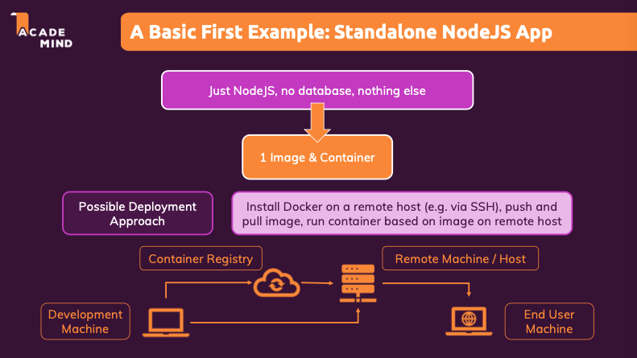

Ci sono vari **Hosting provider**, esempio AWS, AZURE, GOOGLE CLOUD.
Per questo mini progetto useremo **AWS**.

Useremo **AWS EC2** che ci permette di far girare e gestire le nostre macchine remote.

Nel primo esempio faremo semplicemente:

- Creare e lanciare una istanza EC2, VPC e security group
- Configure security group per esporre tutte le porte richieste verso www
- Connetterci all'istanza tramite SSH, installare docker e far girare il container.

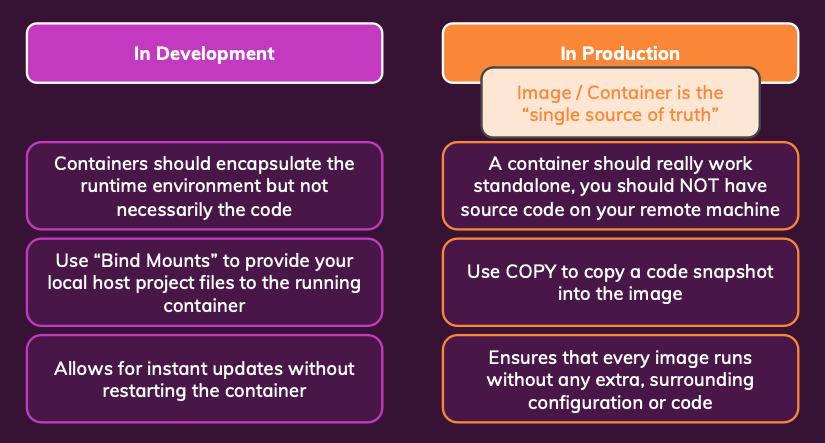

Su AWS console > EC2 > Avvia nuova istanza. Al momento useremo tutte le impostazioni di default e dobbiamo creare una **coppia di chiavi**, che ci serviranno per collegarci dopo alla nostra istanza via **SSH**

Dopo avere avviato l'istanza tramite ssh (secure shell protocol) ci collegheremo all'istanza tramite terminale.

Dall'istanza > Connetti > Client SSH.
Usiamo `chmod 400 "nome chiave"` per dare write permission.
E poi ci colleghiammo con il comando ripotarto nel pannello.
Il terminale adesso agirà non più sulla mia macchina locale, ma su quella remota. CHe figata!

Installiamo Docker :
Aggiorniamo il sistema
`sudo yum update -y`

- `yum` = package manager di Amazon Linux/Red Hat
- `update -y` = aggiorna tutti i pacchetti (il -y dice "sì" a tutto automaticamente)

`sudo yum -y install docker`

Avviamo docker: `sudo service docker start`
Aggiungiamo l'utente al gruppo docker `sudo usermod -a -G docker ec2-user`

dove:

- `usermod` = modifica utente
- `-a -G docker` = aggiunge (-a) l'utente al gruppo (-G) docker
- `ec2-user` = l'utente di default su Amazon Linux

> Per portare l'img sul server remoto abbiamo due opzioni

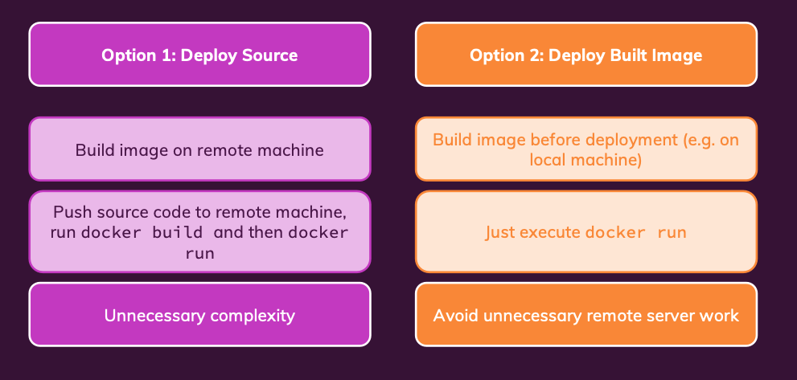

Creiamo un repository su docker hub, e facciamo build img e assegnamo lo stesso nome della repo.

e facciamo il push su docker hub.

> Essendo su mac con processore M devo rifare il build per multiple architetture.
> `docker buildx create --use --name multiarch`

Rebuild e push

```
docker buildx build --platform linux/amd64,linux/arm64 \
  -t pandagandocker/node-example-1 \
  --push .
```

Per verificare le architetture supportate:

`docker manifest inspect pandagandocker/node-example-1`

Sul terminale collegato al server remoto `docker run -d --rm -p 80:80 pandagandocker/node-example-1`
Per testare l'app che gira sul server remoto usiamo l'**indirizzo IPv4 publico**. Di default è disconessa da qualisiasi accesso al WWW.

Quindi da **Reti e sicurezza > Gruppi di sicurezza >** e individuo quello usato dalla nostra istanza. Questo gruppo avrà **regole in entrata e in uscita**. Nelle regole in entrata vediamo che è aperta "a tutto il mondo" con solo la porta 22 (per questo è molto importante la chiave di autenticazione ssh). Dobbiamo permettere del traffico http. Per farlo aggiungiamo una nuova regoal in entrata, di tipo HTTPS e con la porta 80. Ora se usiamo l'**indirizzo IPv4 publico** siamo in grado di comunicare con la nostra app che sta girando su un server remoto.

## Come fare update al codice

Facciamo rebuild, push, e la aggiorniamo sul remote server.
Rebuild e push

```
docker buildx build --platform linux/amd64,linux/arm64 \
  -t pandagandocker/node-example-1 \
  --push .
```

Poi sul server connesso tramite ssh stoppiamo il container attuale
`docker stop "nomecontainer"`
Scarichiamo la nuova immagine da dockerhub e la runniamo:

```bash
docker pull pandagandocker/node-example-1
docker run -d --rm -p 80:80 pandagandocker/node-example-1
```

## Come stoppare/mettere in pausa istanza

`docker stop "nomecontainer"`
in modo permanente da EC2 > istanze > **termina (elimina) istanza** oppure **arresta istanza**

## Svantaggi di questo approccio

Possiamo definire questo approccio **DO-IT-YOURSELF**, perchè abbiamo dovuto fare tutti gli step manualmente.
E siamo anche completamente responsabili della macchina, e della sua sicurezza:
aggiornamenti, network e gruppi di sicurezza.

## From manual deployment to Managed Service

L'approccio **do it yourself** ci da controllo totale, ma anche tantissime responsabilità. Un **trade-off** è usare una soluzione di terze parti.
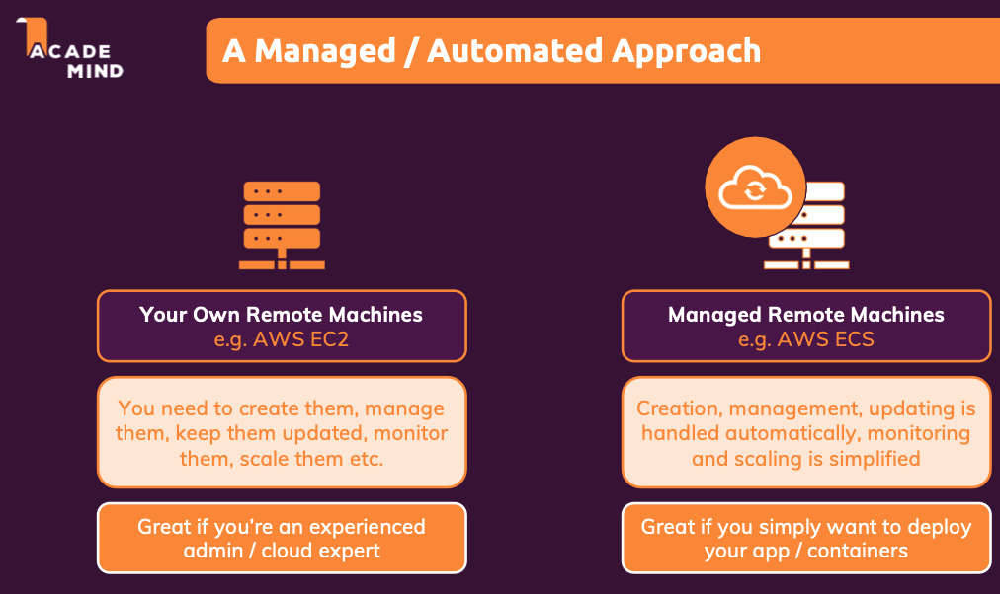

Quindi useremo **ECS** (Elastic container service), dove tutta la parte di sicurezza e aggiornamenti verrà gestita da ECS.
Meno controllo ma meno responsabilità. In un server gestito quindi non useremo i comandi nativi, o lo andremo a installare, perchè verrà gestito tutto da ECS.

Dalla console AWS > ECS > **Definizioni di processo** > crea nuova definizione di attività
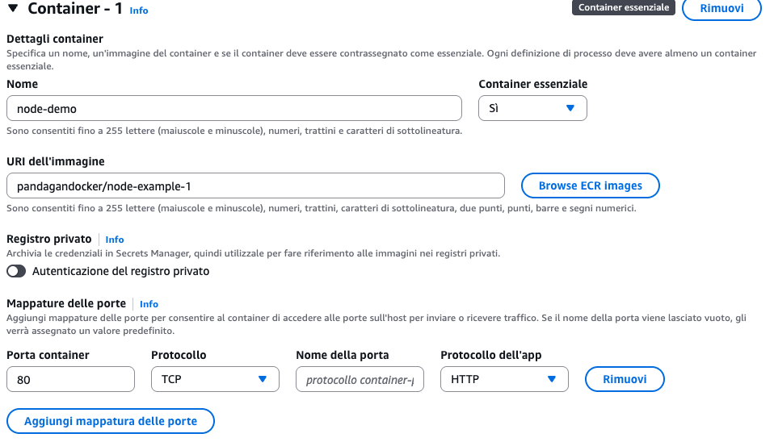

Useremo **AWS Fargate** un modo per lanciare il container serverless.

Caratteristiche principali:

- **Serverless**: Non vedi né gestisci EC2, solo container
- **Pay-per-use**: Paghi solo per CPU/RAM che usi effettivamente
- **Auto-scaling**: Si scala automaticamente in base al carico
- **Zero manutenzione**: AWS gestisce patching, aggiornamenti, sicurezza

✅ Applicazioni web semplici/medie
✅ Microservizi
✅ Task periodici
✅ Quando vuoi "semplicità"

Quando NON usarlo:

❌ Hai bisogno di controllo totale sul server
❌ Applicazioni molto specifiche
❌ Budget limitato per workload sempre attivi

> Poi creiamo un cluster a cui assegnare il servizio creato precedentemente.

## Updating Managed Containers

Quando modifichiamo il codice e lo pushiamo su docker hub, non verrà usata automaticametne la nuova img.

Ma dobbiamo andaare in Definizioni processo > il processo che sto usando > crea nuova revisione.

E poi da ECS > cluster > nome cluster usato > Servizi > il servizio usato > aggiorna.

## 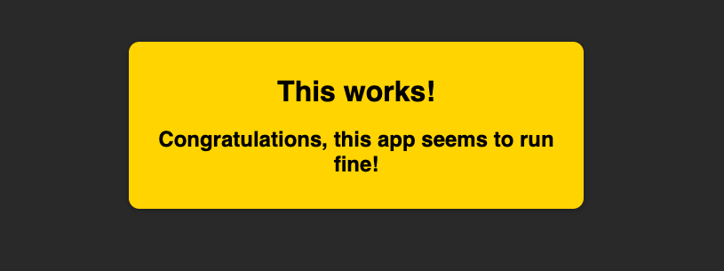

# Preparing a Multi Container APP

In produzione non useremo docker-compose. Ma averlo creato nelle lezioni precedenti ci permetterà di fare il deploy manuale delle varie parti in maniera già strutturata.

`docker buildx build --platform linux/amd64 -t pandagandocker/goals-backend:latest ./backend --push`

`http://goals-alb-1107264905.eu-west-1.elb.amazonaws.com/goals`

soluzione per fare tutto con la nuova versione di aws

2. Once it was working on my local Docker Compose, i rebuilt my backend image.
   Note: I am 1 step outside my backend folder
   docker buildx build --platform linux/amd64 -t [your-namespace]/goals-backend ./backend
   docker push [your-namespace]/goals-backend

CLUSTER 3) Create a Cluster and name it anything (Leave the rest on Default)

TASKS 4) I navigated to "Task Definitions" on the side bar.
infrastructure (Leave the rest on defaults)
Task Name => Any Name
Launch Type =>. AWS Fargate
OS => Linux/X86_64
Task Role => ecsTaskExecutionRole
Task Execution Role => ecsTaskExecutionRole

Note: One Error is caused by the Backend Container trying to connect to the database before the database is ready

Containers
Name => backend
Image URI => [ Your image on Dockerhub ]
Port Mapping => 80 | TCP | skip | HTTP

Environment Variables => The only thing worth noting here is the Mongo url should be "localhost" (That's how AWS work now)

Log Collection => Use it ✅
Startup Dependency => [your database container] | HEALTHY
Name => database
Image URI => [ Your image on Dockerhub ]
Port Mapping => 27017 | TCP | skip | skip

Environment Variables => username | password (must match used in container 1)

Log Collection => Use it ✅

Health Check => We need to set health check because container backend's startup dependency depends on container database to be healthy before it can start up.
    command => CMD-SHELL,mongosh --eval 'db.adminCommand("ping")' || exit 1
    interval => 30
    timeout => 5
    start period => 10
    retries => 3
Once you're done with that Create the Task

SERVICE 5) the Networking bit is the problem here
VPC => default
Subnets => use all available to you
Security Group => Create a new one
Note: Inbound Rule basically controls what ip address can access the application
under inbound rule expose HTTP (port 80 / TCP)  IPv4, IPv6.
This just essentially mean any IP can access this application only through port 80, which is localhost/HTTP.
outbound rule should be allowed on everything from anywhere through IPv4.
Note: At this point you can access the application via the backend container's public address
The problem with that though is after every revision (update) the IP changes, which means we need a load balancer

LOAD BALANCER 6) I created an application Load Balancer with the exact same VPC, subnet and Security Group as my Service.
i created it on IPv4, internet facing
for the Listener, it listens on HTTP
for the target group, follow the tutorial, just make sure your health Check is on "/goals" because its set to "/" by default.

Note: Make sure to attach the Target group to the Load Balancer, and the Load balancer to the service
Note: At this point you can access the application via the DNS on the configuration and networking section of your service.

### Aggiungere un volume

Tipo di configurazione > EFS, Tipo di Volume > EFS.
Ma dobbiamo creare un file system > e andiamo su Amazon EFS console, diamo un nome e personalizza:
Dobbiamo creare un nuovo security group, e diamo una regola di entrata, con tipo **NFS**

> Adesso abbiamo un running server con 2 container, e un volume aggiunto al container database.
> 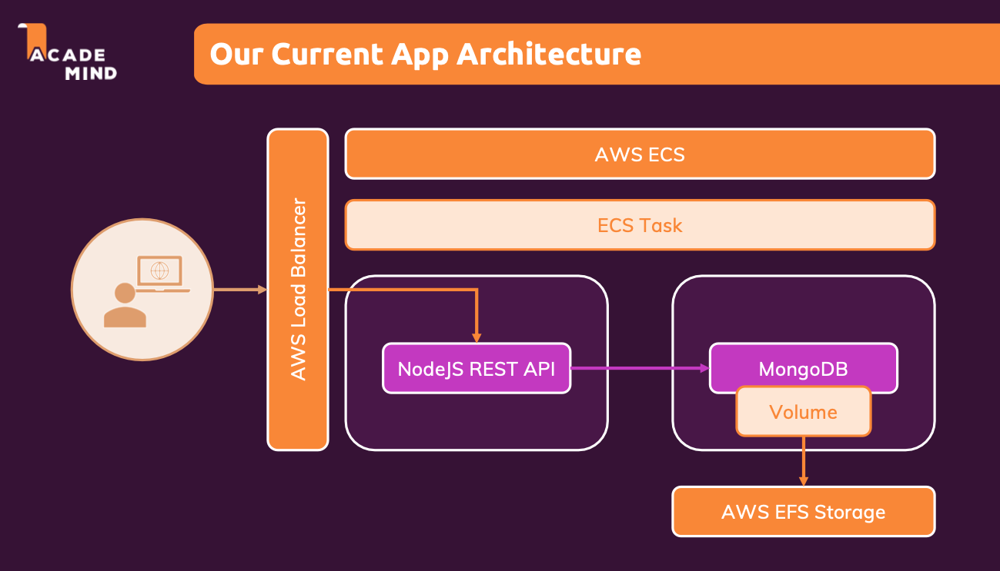

### Database & Containers: An important consideration

Possiamo gestire i nostri container database, come stiamo facendo ora con il nostro container MongoDB, che crea un database e permette di conneterci ad esso con la porta 27017.

Ma questo potrebbe portarci dei problemi:

- **Scaling** & **managing** availability can be challenging (potremmo dover scrivere in maniera simultanea, quindi potremmo avere problemi di sincronizzazione)
- **Performance** (specialmente con spikes di traffico)
- **Backup** & **security**, dobbiamo assicurarci che sia sicuro e che facciamo dei backup periodici.

Quindi dobbiamo considerare l'idea di passare a un servizio gestito di database come **AWS RDS** o **MONGO DB ATLAS** (visto che stiamo lavorando con DB relazionali).

## From data base container to managed DB

> Torna il trade-offs tra **controllo** e **responsabilità**

Se dicidiamo di usare Mongo DB atlas, non abbiamo più bisogno del container mongodb, e dobbiamo sostituire (in backend environment) nelle variabili di ambiente URL di mongo db che dovrà puntare al servizio gestito.

Dopo aver creato tutto su mongodb, da AWS, definizioni di processo, creo una nuova revisione, eliminando il container che si occupa di mongo db, elimino il volume, elimino il fylestem EFS e il security group legato.

Pusho il container modificato e aggiorno le credenziali sul container su aws.

e testo che che il collegamento funzioni
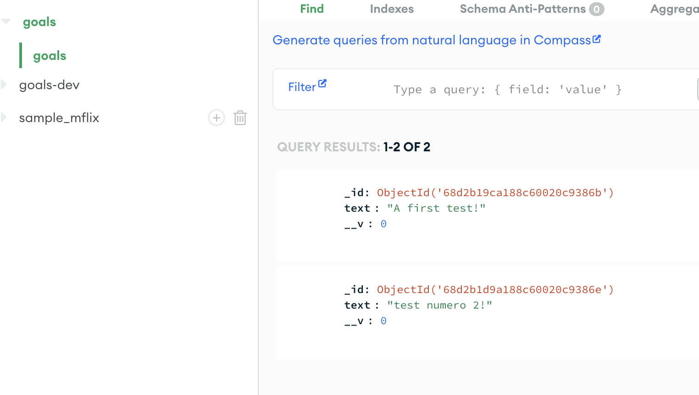

## Final App Architecture

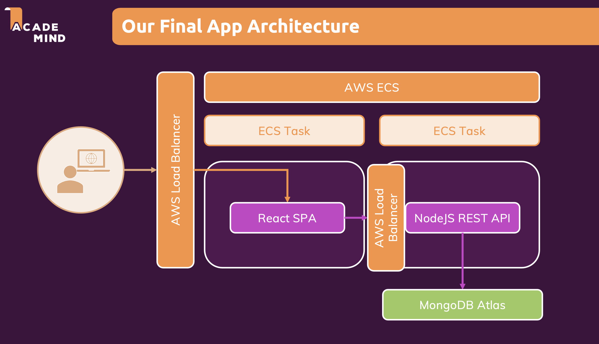
Dopo avere portato il db su Atlas, creeremo un secondo container per il front-end.

Affronteremo il concetto del **build step**.
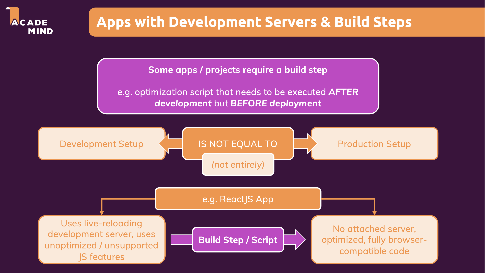.

Qualsiasi app front-end in dev la facciamo girare facendo partire il server con lo script di start, ma non va bene per la produzione. E se facciamo partire lo **script di build**, abbiamo il codice finale **ma non il running server**.

Quindi dobbiamo creare un container diverso per la produzione, in quando il codice deve essere seguito in maniera diversa.

In produzione non abbiamo bisogno di un server **node**, creo un secondo **Dockerfile.prod**

## MULTI STAGE BUILD

Ci permettono di avere un **Dockerfile** ma definisco multipli step di setup/build

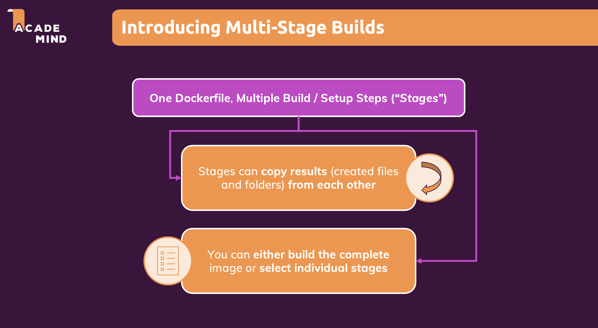

```bash
FROM node:14-alpine as build

WORKDIR /app

COPY package.json .

RUN npm install

COPY . .

RUN npm run build

# Ci serve node solo per servire i file statici
# Ogni istruzione FROM crea un nuovo stage di build
FROM nginx:stable-alpine

# vogliamo usare i file ottimizzati e servirli con nginx

COPY --from=build /app/build /usr/share/nginx/html

EXPOSE 80

CMD ["nginx", "-g", "daemon off;"]
```

Ora facciamo build e push su dockerhub:
`docker buildx build --platform linux/amd64 -t pandagandocker/goals-react:latest -f frontend/Dockerfile.prod ./frontend --push`

Per aggiungere il nuovo container su AWS devo fare una nuova revisione della task definition.
E nella sezione **Ordine delle dipendenze di avvio** impostiamo che il backend deve essere funzionante.
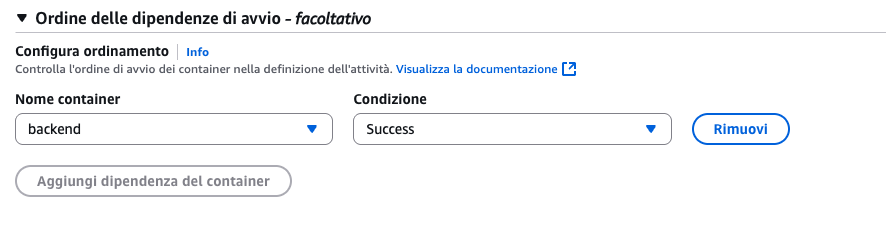

> Ma non possiamo usare per entrambi i container la mappatura della porta 80 nella stessa task.

Quindi dobbiamo creare una nuova definizione di processo a cui poi assegnare un servizio.
Questo ci porterà ad avere due URL uno per il back e uno per il front.
Dobbiamo aggiungere di nuovo url nel frontend, ma fare in modo che sia dinamico.
Non possiamo usare le variaibli di ambiente di docker per il container frontend, perchè il codice non viene eseguito dentro un docker container ma in un browser.
Creiamo un nuovo load balance e gruppo target

Dopo che creiamo la definizione di processo, creiamo un servizio basato su questa task, a cui assegnamo il nuovo load balancer.
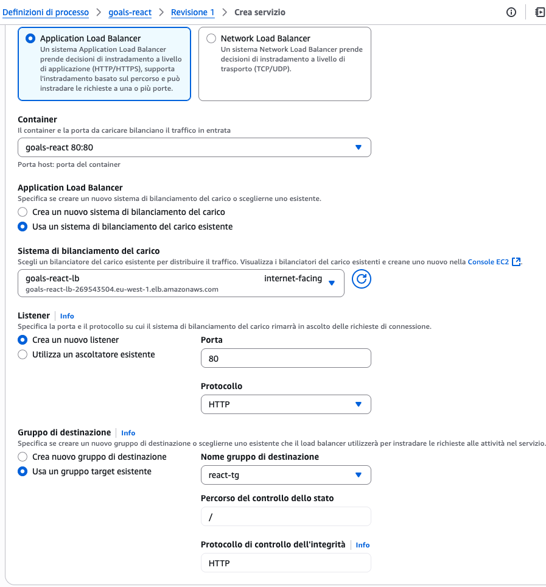

E possiamo usare il front-end!

## Understanding Multi stage build Targets

Con un docker file multi stage, possiamo anche targettare solo una parte per il build e lo facciamo usando `--target "nome"` il nome è quello che abbiamo definito da `FROM img as NOME`
